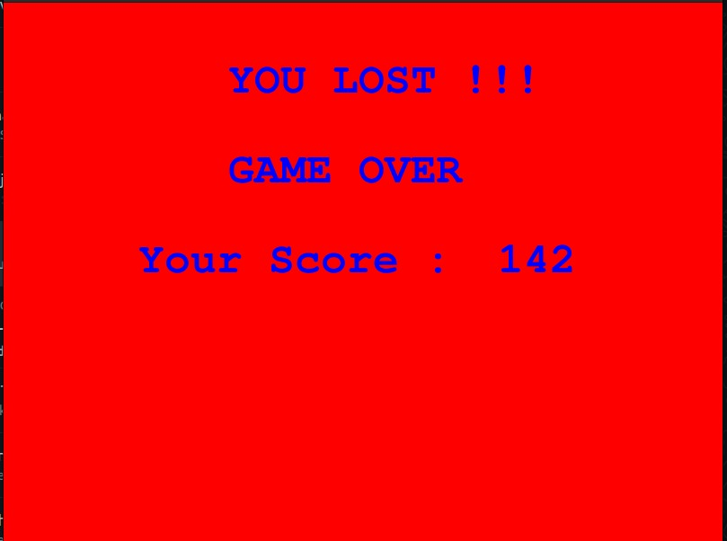

# Games
## Jetpack Joyride : A 2D - Game
Code Link : [Jetpack Joyride](https://iiitaphyd-my.sharepoint.com/:f:/g/personal/rohan_kumar_students_iiit_ac_in/ErLh9Sk-HtBCjUL3pyGo8oMBqD53JcrTCkB8gcsaD30wAg?e=2t2con)

### Components
- Player : Chotta Bheem.
- Obstacles : Tree Trunks (static + moving)
- Rewards : Coins in the way.
- Levels : Three levels (easy-medium-hard)

### Controls
- `Hold Space bar` - Jetpack propulsion `On`.
- `Release Space bar` - Jetpack propulsion `Off`.
** **

</img>
The image displays the start of the game i.e. Level 1. (Slow speed)
** **
</img>
The image displays the mid level of the game i.e. Level 2. (Greater speed)
** **
</img>
The image displays the last level of the game i.e. Level 3. (Max speed)
** **
</img>
The above dialog box opens when the game is over!

## Car Racing : A 3D - Game
Code Link : [Car Racing 3D](https://iiitaphyd-my.sharepoint.com/:f:/g/personal/rohan_kumar_students_iiit_ac_in/EgS2HVfVZx1LsrSmRwnILTIBJ9-78XzbiNgc6kqOV9Kt4g?e=T9xDZr)

Video : 

## Mini-Trailer using Blender
The animated video was made on the theme of the Pathan Movie.
The robbers are rushing away over the bridge and through the road in a yellow truck, and the Hero Pathan enters in a red dashing car with an awesome entry. 
The animations and the objects in the scene were made from Blender, while for the Pathan's car, it was imported as ready-made graphics model.
The video can be viewed below and also on youtube.

3DGame/3dCarGame.mp4

Youtube Link : [Mini Project](https://www.youtube.com/watch?v=_Or09Vg_D80)