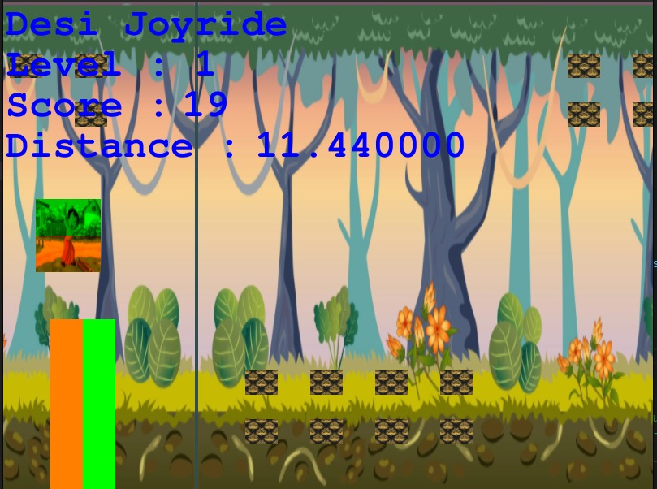
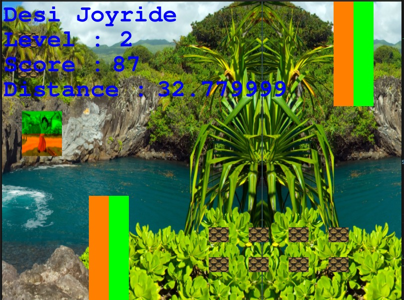
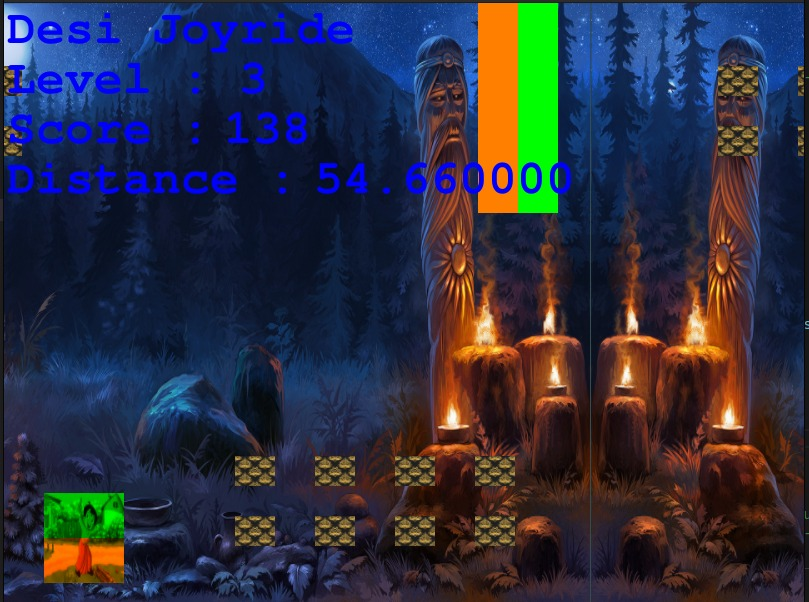
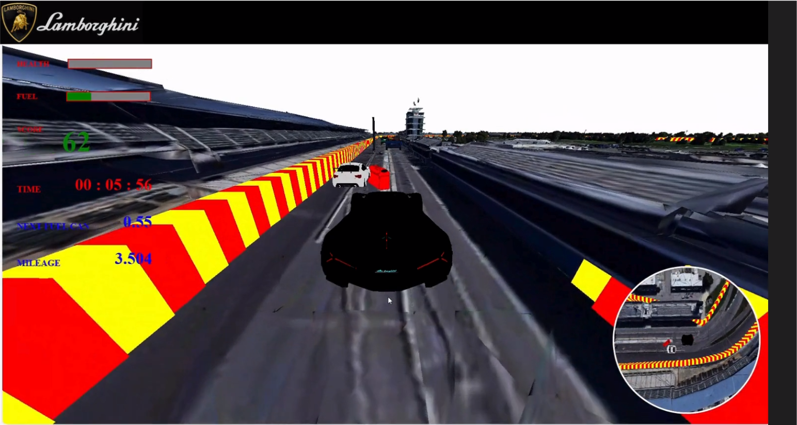
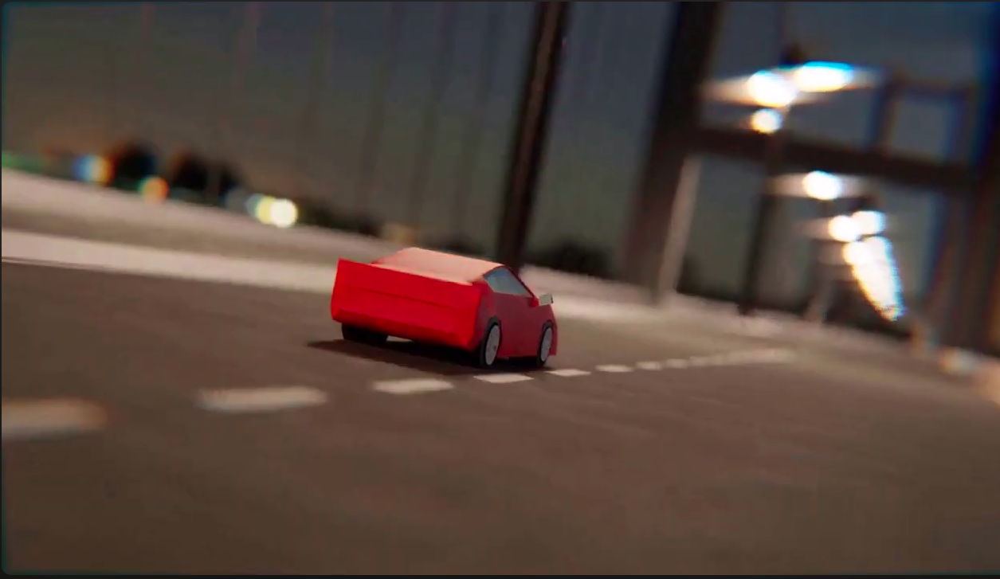

# Games
## Jetpack Joyride : A 2D - Game
Code Link : [Jetpack Joyride](https://iiitaphyd-my.sharepoint.com/:f:/g/personal/rohan_kumar_students_iiit_ac_in/ErLh9Sk-HtBCjUL3pyGo8oMBqD53JcrTCkB8gcsaD30wAg?e=2t2con)

### Components
- Player : Chotta Bheem.
- Obstacles : Tree Trunks (static + moving)
- Rewards : Coins in the way.
- Levels : Three levels (easy-medium-hard)

### Controls
- `Hold Space bar` - Jetpack propulsion `On`.
- `Release Space bar` - Jetpack propulsion `Off`.
** **

</img>
The image displays the start of the game i.e. Level 1. (Slow speed)
** **
</img>
The image displays the mid level of the game i.e. Level 2. (Greater speed)
** **
</img>
The image displays the last level of the game i.e. Level 3. (Max speed)
** **

## Car Racing : A 3D - Game
Code Link : [Car Racing 3D](https://iiitaphyd-my.sharepoint.com/:f:/g/personal/rohan_kumar_students_iiit_ac_in/EgS2HVfVZx1LsrSmRwnILTIBJ9-78XzbiNgc6kqOV9Kt4g?e=T9xDZr)
Youtube Link : [Car Racing 3D](https://youtu.be/pyXwkHO7MfA)


- The game is built WebGL and three.js.
### Installation
```
npm install three
npm install webpack
sudo npm -g install servez
```

### How to run ?
- Run the command :-
```
npx webpack --config webpack.config.js
```
- To start the server :-
```
servez .
```

### Controls and instructions
↑ to accelerate.
← to move left.
↓ to apply brakes.
→ to move right.
T to toggle between camera angles.

Collect fuel cans to increase the fuel.
Collision with car reduces your health.

### Key Features
- Bird eye view : The lower right window gives the bird eye view of the race.
- Camera Angles : Driver view and a external participant view.
- Fuel: There are fuel cans at various places on the track. If you hit a fuel can, your fuel increases.

[](https://youtu.be/pyXwkHO7MfA)


## Mini-Trailer using Blender

Youtube Link : [Mini Project](https://www.youtube.com/watch?v=_Or09Vg_D80)

The animated video was made on the theme of the Pathan Movie.
The robbers are rushing away over the bridge and through the road in a yellow truck, and the Hero Pathan enters in a red dashing car with an awesome entry. 
The animations and the objects in the scene were made from Blender, while for the Pathan's car, it was imported as ready-made graphics model.
The video can be viewed on youtube.

[](https://youtu.be/_Or09Vg_D80)
